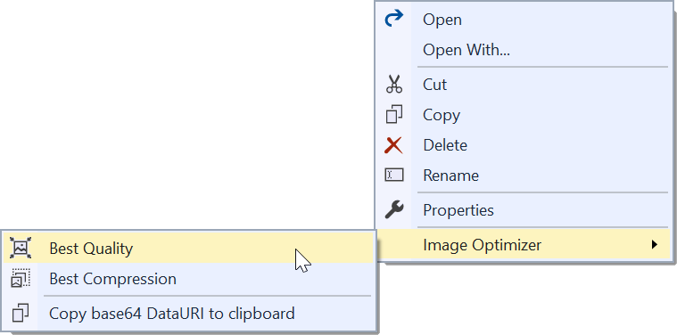
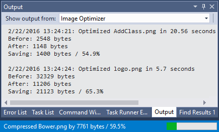

# Image Optimizer for Windows 10

# THIS IS A DRAFT #

--------------------------------

Uses industry standard tools to optimize any JPEG, PNG
and Gifs - including animated Gifs. It can do both lossy
and lossless optimization.

## Features

Adds a right-click menu to any folder and image in Solution Explorer
that let's you automatically optimize all PNG, GIF and JPEG files
in that folder. 

- Optimizes PNGs (uses Zopfli compression)
- Optimizes GIFs
- Optimizes animated GIFs
- Optimizes JPGs (uses MozJPEG)
- Works on single images files or entire folders
- Copy any image as base64 dataURI to clipboard

## Optimize images
Simply right-click any file or folder containing images and click 
one of the image optimization buttons.

You can also right-click a folder to optimize all images inside it.

### Best quality 
If you chose best quality optimization, the tool will
do its optimizations without changing the quality of the image.

### Best compression
If you decide to sacrifice just a small amount of image quality
(which in most cases is unnoticeable to the human eye), you will
be able to save up to 90% of the initial file weight. Lossy
optimization will give you outstanding results with just a
fraction of image quality loss.

## Output window
The Output Window shows the detailed output from the optimization
process and progress is displayed in the status bar.

## Performance
Optimizing an image can easily take several seconds which feels
slow. This extension parallelizes the workload on each CPU core
available on the machine. This speeds up the optimization
significantly.

## API for extenders

The commands are:

* ImageOptimizer.OptimizeLossless - *Optimize for best quality*
* ImageOptimizer.OptimizeLossy - *Optimize for best compression*

## Contribute
Check out the [contribution guidelines](.github/CONTRIBUTING.md)
if you want to contribute to this project.

## Credits
[Mads Kristensen / ImageOptimizer](https://github.com/madskristensen/ImageOptimizer)

## License
[Apache 2.0](LICENSE) for [Mads Kristensen / ImageOptimizer]  

This project is licensed under the MIT License - see the [LICENSE.md](/LICENSE.md) file for details.

Made with ❤️ by [Javier Cañon](https://www.javiercanon.com).

